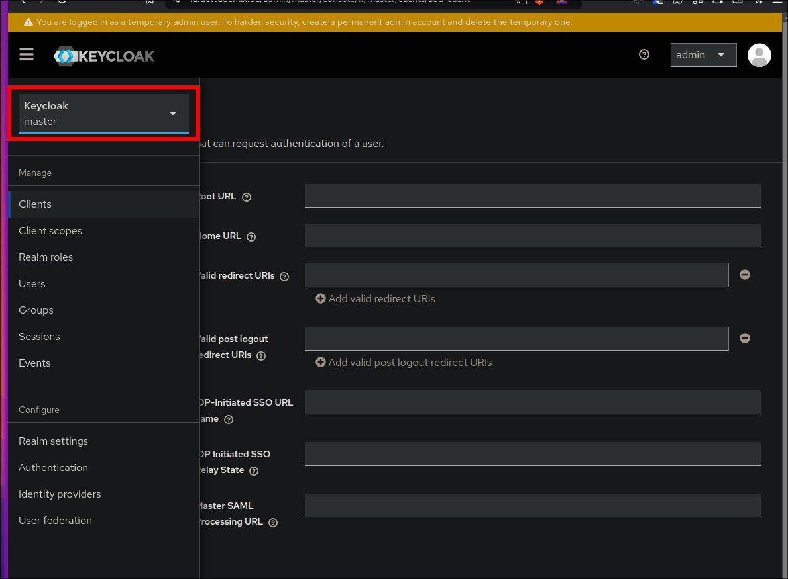

# `Id` Module (Keycloak)
The Id Module in Docmix is responsible for managing user authentication and authorization across all integrated applications. By using Keycloak as the identity provider, the module ensures secure and centralized Single Sign-On (SSO) functionality.

## Overview
Keycloak is a widely-used, open-source identity and access management tool. It simplifies user authentication by providing centralized login flows and advanced features like user federation, role-based access control, and support for modern authentication standards.

## Create Permanent Admin Account
1. Select the `master` Realm 

2. Navigate to `Users`
3. Click on `Add user`
4. Fill in information and enable Email verified
5. Click on `Create`
6. Navigate to `Credentials` tab
7. Click on `Set password`
8. Enter password and confirm
9. Click on `Save`]
10. Navigate to `Role mapping`
11. Click on `Assign role`
12. In the filter select `Filter by realm roles`
13. select admin 
14. Click on `Assign`
15. Again navigate to `Users` in the `master` Realm
16. On the menu of the `admin` user click on `Delete`

## Create new Realm
It is important to seperate the users for the modules/application's themself into a seperate realm.
To create a realm use the following steps. 

1. On the realm slection 

2. Click on `Create realm`
3. Enter a Realm name (e.b. `docmix`) and click on `Create`

For the creation of client's always use the newly created realm

## Setup Instructions
1. Access Keycloak Admin Console
    - After starting the Identity module, access the Keycloak admin console: `https://id.<your-domain>`
    - Log in with the admin credentials set during the cmd init process. You can find them in the `docmix-config` directory parrallel to the `docmix` directory

2. Create a Realm
    - A Realm in Keycloak is an isolated authentication domain. Create a new realm to manage users and applications in your environment:
    - Navigate to Master Realm > Create Realm.  Name the realm (e.g., docmix-realm).

3. Add Users 
    - Add users who will access your applications:
    - Go to Users > Create new user.
    - Set the username and other details, then save.
    - Under the Credentials tab, assign a password or configure temporary credentials.

## Create OIDC Client
1. Navigate to Clients
2. Click on Create Client
3. General Settings:
    - Client type - OpenID Connect
    - Client ID - <your-client-id> ( can be anything but must be unique)
    - Client Name - <your-client-name> ( a descriptive name)
4. Capability config:
    - Only activate Client Authentication and Standard flow
5. Login settings:
    - Root URL - <module_stub>.<base-domain> (e.g., https://git.<base-domain>)
    - Home URL - (optional)
    - Valid redirect URIs - should be specified by the module. bust generally should be at least `/*`
    - Valid post logout URIs - should be specified by the module. bust generally should be at least `/*` (optional)
    - Web origins - optional
6. Client Secret:
    - The secret should never be exposed
    - It can be found on the Credetials tab on the client details page

## Create SAML Client
1. Navigate to Clients
2. Click on Create Client
3. General Settings:
    - Client type - OpenID Connect
    - Client ID - <your-client-id> ( can be anything but must be unique)
    - Client Name - <your-client-name> ( a descriptive name)
4. Login Settings: 
    - Root URL - <module_stub>.<base-domain> (e.g., https://git.<base-domain>)
    - Home URL - (optional)
    - Valid redirect URIs - should be specified by the module. bust generally should be at least `/*`
    - Valid post logout URIs - should be specified by the module. bust generally should be at least `/*` (optional)
    - other fields should be specified by the module

<!-- Configure Clients

Each integrated application (e.g., Nextcloud, GitLab, EspoCRM) is a Client in Keycloak:
Go to Clients > Create.
Enter a client ID (e.g., nextcloud-client) and select the protocol (usually OpenID Connect).
Save and configure the Redirect URI to the application’s URL (e.g., https://<your-domain>/nextcloud).
Set the client’s Access Type to confidential for secure communication.
Enable SSO for Applications

Configure each application to use Keycloak for authentication. This involves:
Setting up the OIDC or SAML endpoint in the application.
Providing the Keycloak Client ID, Client Secret, and Discovery URL (e.g., https://<your-domain>/auth/realms/<realm-name>/.well-known/openid-configuration).
Maintenance Tips
Regular Updates: Ensure Keycloak is kept up-to-date to benefit from security patches and new features.
Backup Configuration: Regularly export the realm configuration to avoid losing critical settings.
Monitor Logs: Check Keycloak logs for any authentication errors or anomalies.
Keycloak Integration in Docmix
The Identity module serves as the backbone of authentication for Docmix. All other modules (e.g., File, Git, CRM) communicate with Keycloak to authenticate users and manage sessions. This centralized approach enhances security and reduces the complexity of managing multiple credentials across applications. -->

<!-- TODO: Roadmap
TODO: Map Roles Saml
TODO: Map Roles Oidc -->