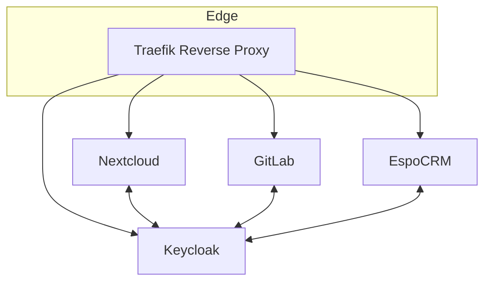

# Docmix
Docmix is an open-source initiative designed to streamline the process of setting up various applications with built-in Single Sign-On (SSO) support. With security and convenience at its core, Docmix makes it easy for anyone—regardless of technical expertise—to deploy applications in a secure and scalable way. The project simplifies the complexities of authentication, data backup, and configuration, while following best security practices.

## What is Docmix?
Docmix is a solution that automates the setup and configuration of applications, ensuring that they operate securely and efficiently. It integrates various tools, services, and applications into a unified environment, simplifying the process of implementing SSO and other security features. Docmix ensures seamless access and management for both individuals looking to manage a few applications and companies deploying enterprise-grade solutions.

### Key Features:
- Single Sign-On (SSO) support for all integrated applications.
- secure default configurations, reducing the risk of misconfigurations.
- easy-to-follow setup steps for users with minimal technical know-how.
- scalable to support various applications and environments.

## Why Docmix? 
Docmix was created to address the growing need for simple, secure, and scalable setups of modern applications. By lowering the technical barriers to entry, Docmix allows users to deploy applications that follow best practices without needing in-depth technical knowledge.

The project’s vision revolves around four main pillars: security, convenience, daily backup and restore tests, and using the best available tools.

### Security
Security is a top priority in the Docmix setup. By default, all applications are configured to run in the most secure manner. With built-in SSO functionality, Docmix limits the need for multiple logins, thereby reducing the attack surface associated with managing credentials across different platforms.

### Convenience
Docmix's core objective is to make application management easy for users, regardless of their technical background. The project automates tedious setup processes, including configurations for SSO, security measures, and dependencies.

- One-click setup for the applications involved.
- Pre-configured settings that minimise the need for manual intervention.
- User-friendly interface that guides the user through each step.

### Backup (Coming Soon)
Data loss can be a significant concern in modern applications. Docmix makes sure that robust backup mechanisms are in place from the start. With minimal configuration, users can set up automatic backups that ensure no data is lost in the event of a failure or outage.

- Automated backups scheduled regularly to ensure data is consistently protected.
- Versioned backups allow you to restore data to any point in time.
- Encrypted backup storage adds an extra layer of protection to sensitive data.
- Daily full backup restore test, to make sure that the backup is working

## Roadmap
The idea is to add one new application per month. More to come.

## Modules

Docmix is organised into modular components, each serving a specific purpose. These modules are designed to work seamlessly together, ensuring that users have a cohesive experience when deploying and managing applications.

### Overview


### Proxy
The proxy module acts as the central reverse proxy for all applications in Docmix. By using Traefik, Docmix provides automatic routing for the applications, making network configuration effortless. Traefik dynamically routes traffic based on incoming requests, ensuring that services are accessible and secure.

Traefik handles SSL certificates, load balancing, and automatic service discovery.
Simplifies the setup of secure web access for all integrated applications.

### Identity
The Identity module is responsible for handling user authentication and Single Sign-On (SSO). Docmix integrates Keycloak, a widely-used identity and access management solution, to provide secure login flows, role-based access control, and centralised user management.

Keycloak allows for OAuth2, OpenID Connect, and SAML authentication.
Centralises user profiles, making it easy to manage users across different applications.
Supports advanced user federation and external identity providers (like Google, LDAP, etc.).

### File
The File module is powered by Nextcloud, a robust file-sharing platform that provides additional features like calendar integration, collaborative editing, and file synchronization. It serves as the central hub for managing files, schedules, and team collaboration.

Nextcloud offers file storage, calendars, contacts, and shared collaborative tools.
Secure file access and sharing with fine-grained permission controls.
Integrated versioning and encrypted backups to ensure data safety.

### CRM
For customer relationship management, Docmix integrates EspoCRM in the crm module. EspoCRM is a powerful and flexible CRM solution that helps teams manage customer interactions, sales pipelines, and other business processes with ease.

EspoCRM provides contact management, sales automation, and customer support tools.
Highly customizable, allowing businesses to tailor workflows and data models to their specific needs.
Secure handling of customer data, integrated with the central identity management system.

### Git
The git module uses GitLab, a powerful platform for source code management, continuous integration (CI/CD), and version control. This module enables teams to collaborate on projects, manage repositories, and automate deployment pipelines.

GitLab supports repository management, CI/CD pipelines, issue tracking, and more.
Tight integration with Keycloak for secure authentication and access control.
Built-in code review, project management, and automation tools to streamline development workflows.

## Installation

### Prerequisite

#### SSH
You need to change the default ssh port something else, for example `2222` as port `22` if you'd like to use the git module as it needs it.

#### Docker

#### Git
You need to have `git` available for cloning and updating the repository. 


Here’s a more polished version of the Installation section:

## Prerequisites
Before setting up Docmix, ensure the following requirements are met:

### SSH Configuration
To avoid conflicts with the Git module, which requires port 22 for SSH, it’s recommended to change the default SSH port to a different value, such as 2222.

### Docker
Ensure that both Docker and Docker Compose are installed on your system. Follow the official Docker installation guide [here](https://docs.docker.com/engine/install/).

### Git
You'll need Git installed on your system for cloning and updating the repository.

## Installation

### 1. Clone the Repository
Start by cloning the Docmix repository to your server:

```bash
git clone https://github.com/nGENn/docmix
```

### 2. Navigate to the Configuration Directory
After cloning the repository, navigate to the 'config' folder inside the repository:

```bash
cd docmix/config
```

### 3. Initialise the configuration
In the config folder, you will find a script called cmd. This script initialises the setup and accepts various arguments to configure the environment. First, you need to run the initialisation command:

```bash
./cmd init
```

- `Domain` the domain will be the basis domain. every module will be available under the subdomain `<module_name>.<domain>`
- `Email` the email is at the moment only used for letsencrypt notifications about expiring certificates.

### 4. Start the Reverse Proxy
Once the environment is initialised, start the proxy module to handle traffic routing. Execute the following command:

```bash
./cmd start proxy
```

### 5. Start the identity module
Once the proxy is running we can start the identity module for authentication in each module

```bash
./cmd start identity
```

### 6. Start other modules
After the proxy is running, you can start additional modules as needed. For example, to start the git module (GitLab), run:


```bash
./cmd start git
```

You can similarly start any other modules by replacing `git` with the desired module name (e.g., `file` for Nextcloud or `crm` for EspoCRM).
